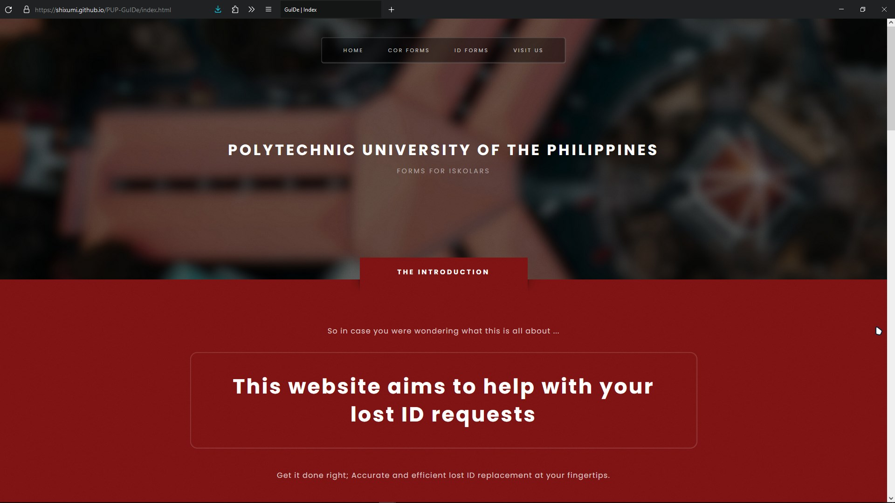
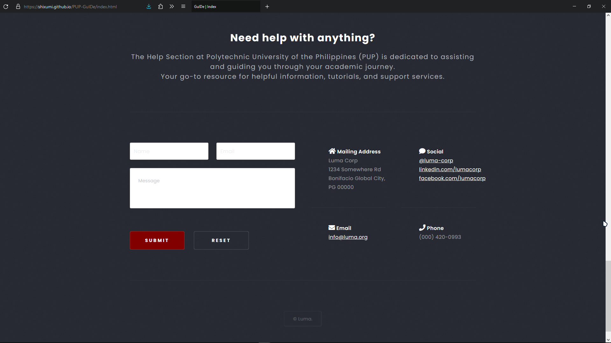
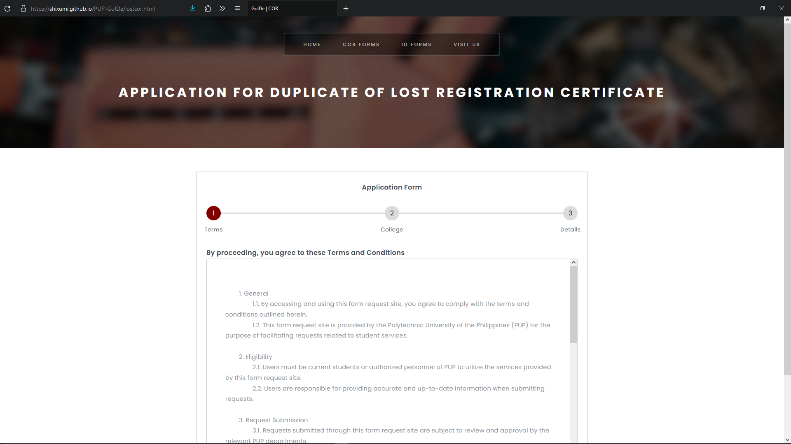

# PUP GuIDE Documentation

## Introduction
PUP GuIDE (PUP Unofficial Forms Website for Lost IDs and COR) is a website that provides a convenient way for students of the Polytechnic University of the Philippines (PUP) to request replacement for their lost identification cards (IDs) and certificates of registration (COR).

## Technologies Used:

Frontend: HTML, CSS, JavaScript
Backend: Node.js
File Storage: Google Sheets
Hosting: Github

## Overview
### Homepage
This is the landing page of our GuIDe, where you can access our list of forms through the **navigation bar**, or the **get started** button.

### Contact
This is where you can contact us, for any support relating to our website. Your messages are directed straight to our emails to ensure a fast response.

### Forms
This is where you apply for an ID or a COR.

### Challenges Faced
During the development of PUP GuIDE, the development team encountered several challenges:

1. Third Party Integration: Integrating Google Sheets for file storage and retrieval within PUP GuIDE necessitated a deep understanding and utilization of the Google Sheets API. Overcoming authentication hurdles and ensuring seamless data synchronization between the website and Google Sheets presented significant challenges. The team encountered errors and inconsistencies during the integration process, particularly in handling authentication tokens and managing data synchronization. These issues were critical to address as they directly impacted the platform's functionality and user experience. Despite the challenges, seamless integration with Google Sheets was essential for providing users with a convenient solution for their information.

2. Form Validation: Implementing robust form validation was paramount for ensuring the accuracy and completeness of submitted data within PUP GuIDE. However, achieving this goal presented several challenges, particularly in handling various edge cases and validating inputs against specific criteria. Balancing the interactions between pop-ups, validations, and form submissions proved to be particularly challenging, especially in JavaScript and CSS. We encountered difficulties in ensuring that validations triggered appropriately, feedback was provided to users in a clear and intuitive manner, and form submissions were processed accurately. Additionally, reconciling the need for comprehensive validation with maintaining a seamless user experience added complexity to the development process. Striking the right balance between thorough validation and user-friendly interactions required careful consideration and iterative refinement.

3. Hosting Limitations: Hosting the PUP GuIDE website on GitHub Pages introduced constraints related to server-side processing capabilities and backend functionalities. Unlike traditional web hosting platforms, GitHub Pages primarily serves static content, limiting the ability to execute server-side scripts or database operations. This posed a challenge for implementing dynamic features and backend logic required for user authentication, form submissions, and data processing. To address these limitations, the development team implemented workarounds and optimizations to enhance the platform's functionality while maintaining reliability and performance. Strategies such as leveraging client-side JavaScript for form validation and interaction, integrating third-party services for backend functionalities like authentication, and optimizing client-side caching and performance were employed. Despite the constraints imposed by GitHub Pages hosting, we successfully delivered a functional and performant website by creatively overcoming these limitations and maximizing the capabilities of the platform.

4. Version Control and Collaboration: Managing version control and facilitating collaboration posed a significant challenge, particularly in a distributed team environment utilizing GitHub. Effective communication and coordination were essential to ensure that weremained synchronized and aligned with project goals. Establishing clear workflows, including branching strategies for feature development, bug fixes, and release management, was crucial to maintain code quality and project organization. Additionally, implementing robust code review processes helped identify and address issues early in the development lifecycle, promoting collaboration and knowledge sharing between us. Overcoming this challenge required not only technical proficiency in utilizing Git and GitHub but also fostering a culture of transparency, accountability, and continuous improvement within the development team. Through effective version control practices and collaborative workflows, we successfully navigated the complexities of distributed development, ultimately contributing to the success of the PUP GuIDE.

5. User Experience Optimization: Optimizing user experience (UX) presented a formidable challenge. Balancing functionality with usability within the limitations of frontend technologies required careful consideration and iterative refinement. Initially, achieving an intuitive and seamless document submission process proved challenging due to the complexities of form validation, user feedback mechanisms, and responsive design implementation. As we iterated through design improvements and optimizations, we encountered hurdles such as maintaining consistency across different devices and browsers, optimizing load times, and ensuring a user-friendly interface for the users. Overcoming these challenges demanded a comprehensive understanding of UX principles, continuous user testing and feedback gathering, and a willingness to adapt and iterate based on insights gained from real-world usage. Through persistent effort and collaboration, we successfully enhanced usability and streamlined the document submission process, ultimately delivering an improved user experience the users.

6. Unfamiliarity and Learning within the Process: Playing around with CSS and understanding the complexities of website development posed a significant challenge. CSS, in particular, presented a steep learning curve due to its intricate syntax and diverse range of styling techniques. As we grappled with concepts such as overlays, designs, and layout models, we encountered difficulties in achieving desired design outcomes and ensuring cross-browser compatibility, as well as website responsiveness. Moreover, navigating the plethora of CSS frameworks and libraries added further complexity, requiring careful evaluation and decision-making. Overcoming this challenge demanded dedication, extensive practice, and continuous learning to acquire proficiency in CSS and effectively translate design concepts into responsive and visually appealing web interfaces.

### Conclusion
PUP GuIDE aims to simplify the process of requesting replacement IDs and COR for PUP students. By addressing the challenges faced during development and continuously improving the website, the team strives to provide a reliable and efficient service to the PUP community.
